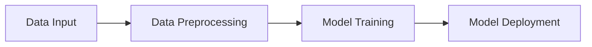

# Project Customer Score
### 0754_MLOPS_MLProd_Project

## Table of Contents
* [About](#about)
* [General Information](#general-information)
* [Languages](#languages)
* [Libraries Used](#libraries-used)
* [Dataset Information](#dataset-information)
* [Resources](#resources)

 
 

## About
Project to predict customer satisfaction given a set of inputs regarding customer's E-commerce data.

 

## General Information

Project development to predict the customer satisfaction given a series of inputs regarding customer's E-commerce data using MLOPS.

 

## Languages
Languages
    Python

 

## Libraries Used
Some of the libraries used are:
    Docker
    Numpy
    Pandas
    Scikit-Learn
    ZenML
    MlFlow
    Streamlit
    MermaidJS

 

## Dataset Information
This dataset contains customer information of a Brazilian E-commerce site by Olist.

[Brazilian E-Commerce Public Dataset by Olist, and André Sionek](https://doi.org/10.34740/KAGGLE/DSV/195341)

 

###### Diagram_001

<<<<<<< HEAD
=======

###### Diagram_002

>>>>>>> 909da45b8962d07cc59652e0ae2f8ede271e6e8b
###### Diagram_003

###### Diagram_004

 

 

## Resources

###### *Code based on [Free Code Camp](https://www.freecodecamp.org/). Special Thanks to Free Code Camp and instructor [Ayush Singh](https://github.com/ayush714)*

###### Dataset [Olist, and André Sionek. (2018). Brazilian E-Commerce Public Dataset by Olist [Data set]. Kaggle.](https://doi.org/10.34740/KAGGLE/DSV/195341)

## Acknowledgements

##### Thanks to Olist for releasing this dataset.
##### Thank you kindly to all who make information and knowledge available for free.

----
